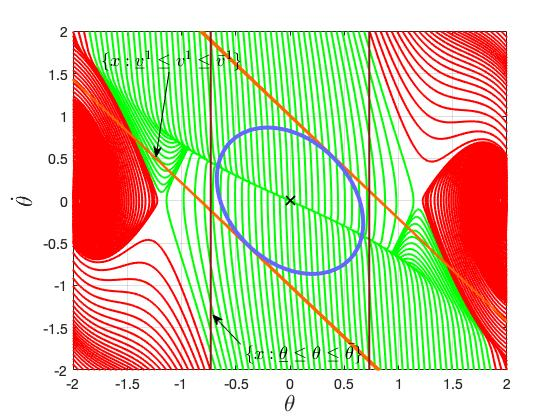

# Stability-Analysis-using-Quadratic-Constraints-for-Systems-with-Neural-Network-Controllers
This code is to accompany the paper [Stability Analysis using Quadratic Constraints for Systems with Neural Network Controllers](https://arxiv.org/pdf/2006.07579.pdf). It computes an ellipsoidal inner-approximation to the region of attraction of NN controlled-systems.

### Authors:
* He Yin (he_yin at berkeley.edu)
* Peter Seiler (pseiler at umich.edu)
* Murat Arcak (arcak at berkeley.edu)

## Getting Started
All the code is written in MATLAB.

### Prerequisites
There are two packages required:
* [MOSEK](https://www.mosek.com/): Commercial semidefinite programming solver
* [CVX](http://cvxr.com/cvx/): Matlab software for convex programming
To plot the computed ROA, two more packages are required:
* [SOSOPT](https://dept.aem.umn.edu/~AerospaceControl/): General SOS optimization utility
* [Multipoly](https://dept.aem.umn.edu/~AerospaceControl/): Package used to represent multivariate polynomials

### Way of Using the Code
* Interted pendulum example: In the folder **Inverted_Pendulum_control_saturation**, the actuator saturation is considered; and in the folder **Inverted_Pendulum_no_saturation**, the actuator saturation is not considered. In both folders, run the file **Pendulum_sin_local.m** to compute the ROA inner-approximation.
* vehicle lateral control example: two experiments are includes. In the file **Vehicle_Sector_LTIunc.m**, the activation functions in the neural network are described only by the sector IQC; in the file **Vehicle_Offby1andSector_LTIunc.m**, the activation functions are described by both off-by-one and sector IQCs. Run **plot_Figure8.m** to visualize the results.

## ROA inner-approximation for a control saturated inverted pendulum
